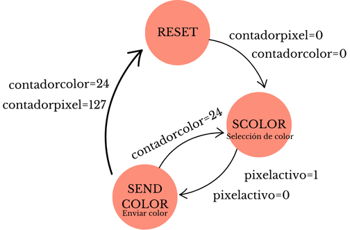
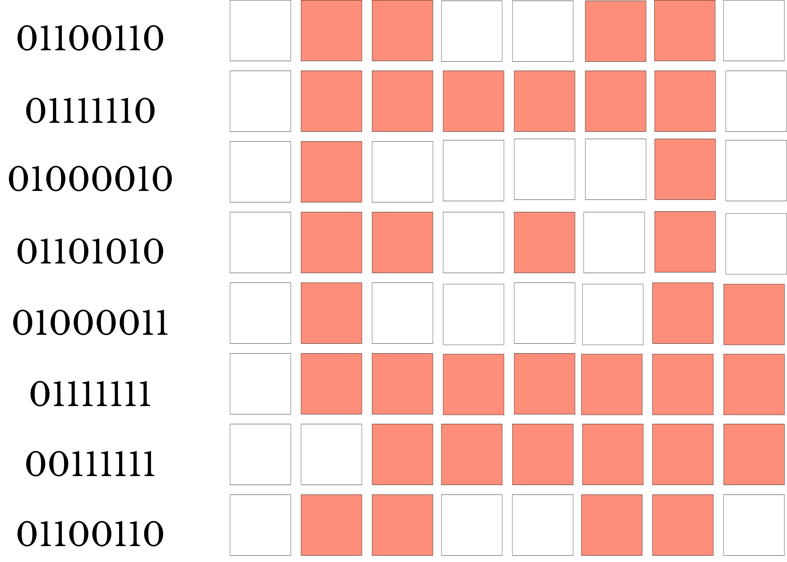
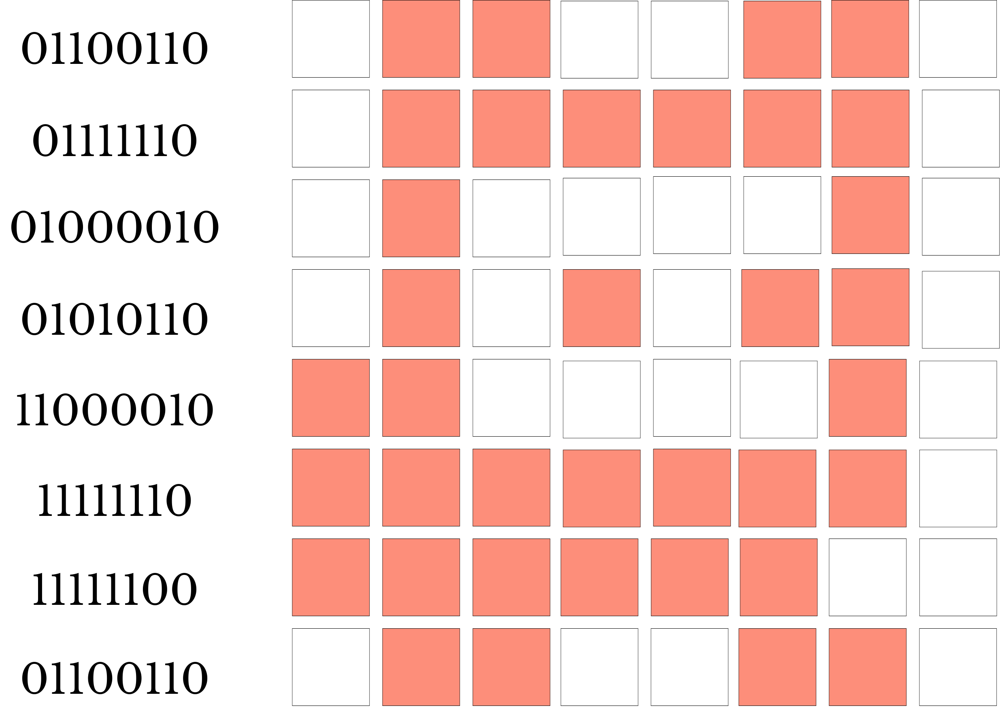
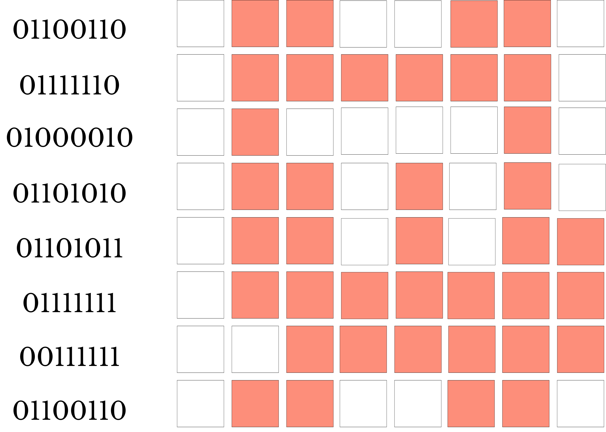
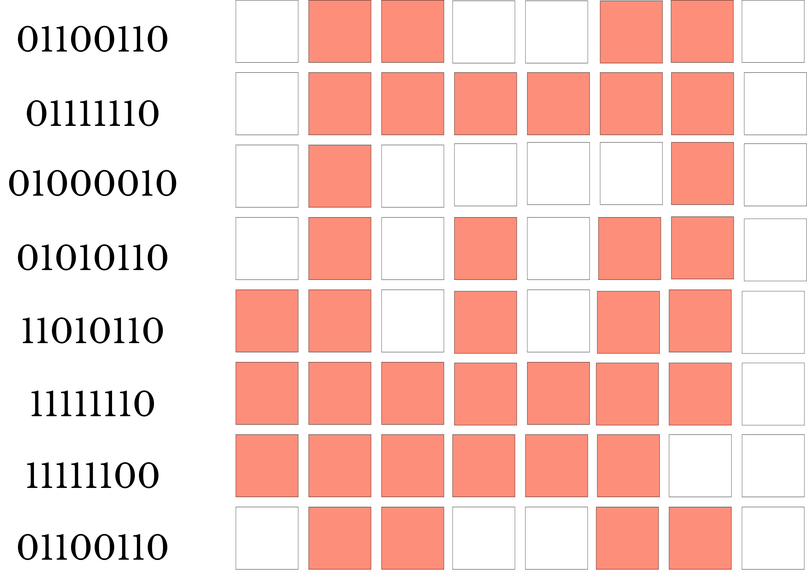

 # Proyecto I Electronica Digital I

* Camilo Prieto Gomez - 1000364337
* Tait Mozuca Tamayo - 1193560405
* Leidy Pinto Ramos - 1000787494
  
## Descripción general y especificaciones de los sistemas que conforman el proyecto:
Un Tamagotchi es un aparato electrónico con forma de huevo en el que aparece una mascota virtual que se puede cuidar mediante generalmente tres botones. En nuestro proyecto, buscamos emular este dispositivo utilizando una FPGA Cyclone IV EP4CE6E22C8N y diversos sensores y elementos electrónicos, los cuales detallaremos en este documento.

El proyecto cuenta con cuatro botones, de los cuales cuatro estarán destinados a interactuar directamente con las necesidades del Tamagotchi (alimentar, dormir, curar y jugar), un boton cambiador de tiempo, un boton test que permite examinar cada una de las condiciones de la mascota virtual y un boton de reset completo del juego. Además, contará con dos pantallas de matriz de LEDs WS2812, cada una de 8x8 píxeles: una mostrará el personaje y la otra las barras y estados de energía. También incluye dos sensores externos: un sensor de luz y un sensor de movimiento ultrasónico para generar interacción con el juego.

El diagrama anterior demuestra el funcionamiento global del proyecto. Los tres módulos mostrados serán los encargados de proporcionar la información adecuada a la FPGA para comunicar los botones y sensores con la imagen de la mascota virtual. Es de gran importancia tener en cuenta la cantidad de bits a utilizar y que cada uno de estos módulos contiene submódulos clave que generan distintas salidas relevantes para el funcionamiento del proyecto y permiten el funcionamiento básico del Tamagotchi.

Es importante considerar la cantidad de bits de entrada y salida. Los botones utilizarán 8 bits, ya que cada botón proporcionará un bit de información al sistema. Los sensores se comunicarán mediante un bit de bandera que notificará a la FPGA sobre los cambios en el exterior; un bit será para el sensor de movimiento y otro bit para el sensor de luz.

En total, se utilizarán quince bits para las necesidades, distribuidos en 3 bits por cada una (salud, entretenimiento, energía, alimentación e higiene). Además, se asignarán cuatro bits para el estado del Tamagotchi, acorde al nivel de sus necesidades. Finalmente, las salidas consistirán en un bit de datos que transmitirá la información a las pantallas y 15 bits distribuidos entre los 8 ánodos y el display de siete segmentos.

## Funcionamiento controlador principal: 
### Control pricipal
El control principal contendra los principales modulos del proyecto los cuales lo conforma el control principal, logica de estado, driver del sensor ultrasonido y control de tiempo que seran explicados uno por a uno a continuación
La siguiente imagen describe el sistema de caja negra del controlador principal, con cada una de sus entradas y módulos principales, cuyos salidas principales están relacionadas con el estado de ánimo del Tamagotchi

El módulo principal se encargará de reducir y aumentar los niveles de necesidades del Tamagotchi a lo largo del tiempo, además de permitir el ajuste de estos niveles mediante el uso de botones y sensores periféricos externos. También habilita el funcionamiento del modo de prueba, que evalúa cada uno de los posibles estados del Tamagotchi, y el modo de reinicio, que restablece todas las condiciones del Tamagotchi a su estado inicial. Estos botones deben ser oprimidos de forma continua durante al menos 5 segundos para garantizar su funcionamiento.
## Necesidades:
El sistema tendra 4 necesidades(se mostrarán en barras de estado en la segunda pantalla led) cada una tiene un nivel de satisfacción del 1 como nivel mínimo y 8 como el máximo.
* Energía
* salud
* Comida
* Entretenimiento
* higiene

  ## Interacciones
Las necesidades bajaran automáticamente con el tiempo de la siguiente manera:
* Salud: -1 nivel cada 10 minutos
* Comida: -1 nivel cada 5 minutos
* Energía: -1 Nivel cada 7 minutos
* Entretenimiento: -1 Nivel cada 3 minutos
* Higiene: -1 nivel cada 7 minutos
* Cabe aclarar que estos tiempos se modifican cuando el modo de velocidad no es X1, por lo que en los otros casos(x2,x5,x10) disminuiran proporcionalmente al valor de velocidad segun la modalidad elegida por el jugador.

El comportamiento de la velocidad sera explicado mas adelaante para el modulo de controlador de tiempo que determina como pasa el tiempo en la modalidad de juego de la mascota virtual

Los diagramas anteriores demuestra el funcionamiento del módulo principal, el cual utiliza el flanco de subida del reloj para incrementar distintos tipos de contadores. Cuando los contadores alcanzan ciertos valores, las necesidades disminuyen. Además, se describe cómo la función de dormir dependerá de que ambos sensores estén inactivos y de que el estado de salud y el de alimentación sean mayores a 2. También se detallan los botones de prueba y reinicio, así como sus restricciones respecto al estado del modo y cómo afectan a los contadores y botones.

La anterior simulación muestra, en cambio, el comportamiento del control principal conforme se presionan los botones. En esta simulación, se observa cómo los niveles de energía pasan de 6 a 7 en la puntuación.

### Logica de estado
El modulo logica de estado maneja cierta cantidad de condiciones que permiten otorgar bit a una serie de registros que se suman de forma acomulativa, cuando estos rangos son superados segun las necesidades que arroja el modulo control principal, el resultado acomulatuvo determinara el tipo de estado que corresponde a los siguientes:
## Estados: 
La mascota virtual contara con 10 diferentes estados, cada uno sera representado con un color especifico para ser facilmente identificado por el jugador:
*	Estado cansado: la necesidad de energía se encuentra en 5 o por debajo(Azul)
*	Estado dormido: el tamaguchi se encuentra dormido(morado)
*	Estado Hambriento: la necesidad de comida se encuentra en 5 o por debajo(Amarillo)
*	Estado enfermo: la necesidad de salud se encuentra en 5 o por debajo(Rojo)
*	Estado aburrido: la necesidad de entretenimiento se encuentra en 5 o por debajo(Naranja)
*	Estado sucio: la necesidad de Higiene se encuentra en 5 o por debajo(Csfe)
*	Estado bien: Todas las necesidades se encuentran por encima del nivel 5, y la mascota se Encuentra generalmente satisfecha(Verde)
*	Estado excelente: todas las necesidades están en el máximo posible(Verde Claro)
*	Estado Desolado: todas las necesidadescasi en lo mas bajo posible (Blanco Tenue)
*	Estado Muerto: todas las necesidades en cero(Blanco)

## Sistema de caja negra completo:

El proyecto esta conformado por los siguientes elementos:

## Sistema de botones: 

Para los 7 botones antirrebote se usa el módulo "debounce", que se encarga de limpiar la señal del botón y eliminar los rebotes que se producen al presionarlo.
**botondebounced** es la salida del botón cuando ya se encuentra limpia; las variables internas son previous, compare, buttonneg y el contador. previous es una señal que almacena el último estado estable del botón; compare detecta si el estado actual del botón es diferente al último estado almacenado; buttonneg es la versión negada del botón. Ésta sirve para los botones normalmente abiertos. Finalmente, el contador cuenta el tiempo para estabilizar el botón después de detectar un cambio.
### Simulaciones: 
> 

## Sistema de Sensores:
Se contarán con 2 sensores, 1 sensor ultrasónico HC-SR04 y un sensor de luz
 
1. **sensor ultrasónico:** Periférico encargado de generar una única salida es 1 bit que indica una bandera de “Cercanía”, el cual se direccionara por medio del modulo especifico de driver ultrasonido.

 

2. **sensor de luz:** Periférico encargado de generar una única salida es 1 bit que indica una bandera de “claridad”. S realizara por medio de una fotoresistencia relacionada con un circuito de un amplificador operacional donde el valor de la fotoresistencia generara modificaciones en la entrada inversora modificando la salida del amplificador dependiendo la cantidad de luz que reciba.

## Sistema de visualización: 

Pantallas 8x8 matriz de leds WS2812 : Esta pantalla utiliza el sistema RGB(Red,green,blue) de 24 bits, corresponderan a 2 pantallas de 8x8 que funcionaran por medio del** protocolo de comunicación unidireccional en serie de 1-wire** enviando el código RGB de cada color en binario por cada pixel, la pantalla guarda el dato del pixel y lo va desplazando de pixel a pixel, la codificación de cada bit se hace en funcion de un pulso PWM en donde un rango de porcentajes de PWM indican un uno lógico para la pantalla y otro rango diferente de porcentajes PWM indican un cero lógico. EN donde de esta manera se envían 24 bits lógicos que indican un código RGB para ese pixel, cuando se envie otro código con el único canal de datos, el código enviado anteriormente pasara al siguiente pixel y el nuevo código de almacenara en el primer pixel. Para dejar de mandar datos se deja descansar la pantalla por 0.5 segundos, asegurando que todos los LEDs reciban la información correcta para enviar por ultimo la señal reset y actualizar nuevamente la informacion de los LEDs.

Pantallas 8x8 matriz de leds RGB: la primera mostrara las imágenes del Yamaguchi reflejando con animaciones y con sus colores su estado actual según sus necesidades. La segunda mostrara 5 barras que indican el nivel de necesidad respectivo por cada ítem, para mostrar que tan necesitado se encuentra en su necesidad actual.

El control de imagen del proyecto en grosomodo va a encender pixeles específicos y asignarles un color dependiendo del estado del tamagushi. Esto se va a hacer por pasos:

En el estado SCOLOR se asigna un color a cada estado, si el pixel no está activo se envía el color negro.

Cuando se elige el color dependiendo del estado del tamagushi se pasa al estado SENDCOLOR, sin embargo, este estado no solo funciona enviando los bits de datos del color, también elige la animación que se va a mostrar en pantalla.

Para el envío de bits de color se usó un multiplexor debido a que hay que enviar los datos de color uno por uno (se envían los bits de color verde, luego los bits de color azul y por último los bits de color rojo). Este multiplexor se puede ver en el módulo mux24. 

Para la animación,  esta animación depende del estado del tamagushi y también del tiempo que se lleva mostrando la animación actual, si se han mantenido 4 frames de la animación actual pasa a la siguiente (un frame (cframe) se completa cuando se enviaron los 127 pixeles). Por ejemplo, para el estado estado == 4'b0000 (cuando el tamagushi se encuentra en el estado "bien") la animación por defecto es la primera, si se mantiene 4 frames en este estado se pasa al estado 2, esto hace ver al tamagushi de forma más dinámica. Las animaciones se encuentran a continuación. 

Se dibujaron las visualizaciones, se escribieron en binario y luego se pasó esté código a hexadecimal.

En código hexadecimal de las animaciones queda así: (El código de las animaciones es el llamado ROMAnimation)
* 667E426A437F3F66
* 667E4256C2FEFC66
* 667E426A6B7F3F66
* 667E4256D6FEFC66
* 667E4242427E3C66

Estas animaciones van a ir a un multiplexor de 64, este, va a recibir el código de las animaciones y va a seleccionar que pixeles van a estar activos.

Para transmitir los bits para cada led se tiene que enviar un pulso, para el bit=0, la señal en alto tiene que ser muy corto, aproximadamente 350ns y una señal en bajo larga, 800ns. Para el bit=1, se necesita lo contrario, la señal en alto es de 700ns y la señal en bajo es de 600ns. (Estos valores fueron tomados del datasheet de la pantalla). Se necesitan estos valores en ciclos de reloj, debido a que la fpga tiene una frecuencia de 50mHz, 20ns, los valores para el bit 0, son de HL=17 ciclos, LL=40 ciclos, y para el bit 1, HL=35 ciclos, LL=30 ciclos. El tamaño del bit a transmitir es de 24 bits por pixel, por lo que son 3072 bits para las dos pantallas.

El diagrama muestra la máquina de estados del transmisor para las pantallas.

El módulo transmisor se encarga de este trabajo. En el código se puede ver como se recibe el dato, lo convierte en ciclos y también hay un contador de cuantos datos se han recibido, así, al llegar al bit 3072 se reinicia el código.

## Visualización de velocidad y puntuación

En esta sección del proyecto, con la ayuda de un módulo covertidor BCD podemos primero asignar los valores correspondientes en la primera parte del código, y después visualizar con la ayuda del bloque **control** el número correspondiente al nivel de velocidad y a la puntuación en el display de 7 segmentos dividiéndolo en miles, centenas, decenas y unidades. Aunque usamos 8 ánodos, sólo tendremos activos 6 de ellos.

Para el caso de la velocidad, tendremos el siguiente bloque de código:
> 

que está encargado de asignarle un valor a la decena/unidad velocidad dependiendo del número binario de 3 bits que tengamos en el momento. Por lo tanto, en vez de tener una representación del número binario a decimal en la simulación, vamos a obtener el número que se le fue asignado en el bloque de código, y luego expresarlo en decenas y unidades.

  ### Simulaciones: 
  #### Visualización de velocidad: 

  > 

  Como se puede ver, en vez de mostrar el equivalente del número binario en número actual o en decenas/unidades, se muestra el valor que se le fue asignado a ese número en el bloque anteriormente mencionado.

  #### Visualización de puntuación:
> 

  ### Máquina de estados:
  > .png)

## FPGA Altera Cyclone IV:
* Funcionalidad: Ejecutar la lógica de control y procesamiento del
Tamagotchi, incluyendo las máquinas de estados, la gestión de los estados y
necesidades de la mascota, y la generación de las señales de visualización.
* Implementación en HDL: La mayor parte de la lógica del Tamagotchi se
implementará en Verilog dentro de la FPGA, utilizando módulos y sub-
módulos para organizar el diseño.

# Especificaciones de Diseño Detalladas

## Necesidades:
El sistema tendra 4 necesidades(se mostrarán en barras de estado en la segunda pantalla led) cada una tiene un nivel de satisfacción del 1 como nivel mínimo y 8 como el máximo.
* Energía
* salud
* Comida
* Entretenimiento
* higiene

## Estados: 
La mascota virtual contara con 11 diferentes estados, cada uno sera representado con un color especifico para ser facilmente identificado por el jugador:
*	Estado cansado: la necesidad de energía se encuentra en 5 o por debajo(Azul)
*	Estado dormido: el tamaguchi se encuentra dormido(morado)
*	Estado Hambriento: la necesidad de comida se encuentra en 5 o por debajo(Amarillo)
*	Estado enfermo: la necesidad de salud se encuentra en 5 o por debajo(Rojo)
*	Estado aburrido: la necesidad de entretenimiento se encuentra en 5 o por debajo(Naranja)
*	Estado sucio: la necesidad de Higiene se encuentra en 5 o por debajo(Csfe)
*	Estado bien: Todas las necesidades se encuentran por encima del nivel 5, y la mascota se Encuentra generalmente satisfecha(Verde)
*	Estado excelente: todas las necesidades están en el máximo posible(Verde Claro)

## Control Puntuación:

Para la puntuación total, que es la suma de los valores de la salud, alimentación, energía, entretenimiento e higiene; éstas son entradas de 3 bits que van del nivel 0 al nivel 7.
**Bonus:** Es un valor que se activa en cuanto llegamos a la puntuación máxima, que es 35; el bonus es de 5 puntos.

**lostsalud, lostalimentacion, lostenergia, lostentretenimiento, losthigiene:** Son valores que representan la pérdida de puntos en la salud, energía y otras necesidades cuando su nivel está por debajo de 2. **puntosperdidos** es la salida que va a representar el total de puntos perdidos por los niveles bajos.

**deadsalud, deadalimentacion, deadenergia, deadentretenimiento, deadhigiene:** Son señales que representan cuando los niveles de salud, energía y entre otros llegaron al nivel 0. **Totalmalaracha** indica cuántos de estos indicadores están en nivel crítico y **negativebonus** penaliza al jugador por 5 punto cuando 2 o más necesidades están en 0.

**totalpuntosperdidos:** Es la suma de negativebonus y puntosperdidos.
Las banderas en el código se utilizan para evitar que se sumen puntos repetidamente dentro del mismo ciclo de reloj. La banderabus, por otro lado, funciona para que el bonus se otorgue sólo una vez en cuando se cumple la condición requerida.

  ### Simulaciones:
  

## Interacciones
Las necesidades bajaran automáticamente con el tiempo de la siguiente manera:
* Salud: 1 nivel cada 10 minutos
* Comida: 1 nivel cada 5 minutos
* Energía: 1 Nivel cada 7 minutos
* Entretenimiento: 1 Nivel cada 3 minutos
* Higiene: 1 nivel cada 7 minutos
* Cabe aclarar que estos tiempos se modifican cuando el modo de velocidad no es X1, por lo que en los otros casos(x2,x5,x10) disminuiran proporcionalmente al valor de velocidad segun la modalidad elegida por el jugador.

# Arquitectura del sistema:

## FPGA Altera Cyclone IV:
* Funcionalidad: Ejecutar la lógica de control y procesamiento del
Tamagotchi, incluyendo la máquina de estados, la gestión de los estados y
necesidades de la mascota, y la generación de las señales de visualización.
* Implementación en HDL: La mayor parte de la lógica del Tamagotchi se
implementará en Verilog dentro de la FPGA, utilizando módulos y sub-
módulos para organizar el diseño.
* Conexión: La FPGA se conectará a los diversos periféricos a través de
interfaces digitales.
## Matriz de LED´s RGB:
* Funcionalidad: Visualizar de estados y barras de las animaciones del
Tamagotchi en dos matrices de LEDs 8x8.
* Implementación en HDL: Se diseñará diferentes modulos en Verilog que se encarguen
de generar las señales de control y datos necesarios para actualizar la
matriz de LEDs.
## Boton reset: 
* Funcionalidad y implementacion: Cuando el botón de reset se mantiene presionado durante más de 5 segundos en el Tamagotchi, el dispositivo transiciona al estado "bien" y todas las necesidades se establecen en un valor de 7. Además, el contador de puntuación se reinicia a 0. En caso de que el Tamagotchi estuviera en modo de prueba, cambiará al modo "normal", donde las necesidades variarán con el tiempo.
* Conexión: pin de entrada/salida (I/O) en la FPGA conectado directamente al botón.
## Boton Test:
* Funcionalidad y implementacion:Al presionar el botón test por mas de 5 segundos, el tamaguchi entra en modo “test” en donde comienza a saltar entre los estados definidos anteriormente, con las condiciones especificadas ya sea el estado “hambriento” en donde todas las necesidades estarán en 7 a excepción de la necesidad “comida” que se encontrara en 5, y así sucesivamente.
* Conexión: pin de entrada/salida (I/O) en la FPGA conectado directamente al botón.
## Boton Acelerador: 
Permite acelerar el tiempo en la modalidad de juego del Tamagotchi, afectando las necesidades de forma mas rapida y haciendo que el nivel de juego sea mucho mas complicado.
## Sensor ultrasonido: 
* Funcionalidad y implementacion: Da un periférico encargado de la lectura del sensor, su única salida es 1 bit que indica una bandera de “Cercanía”, la cual tiene diferentes interacciones con los modulos diseñados de la fpga.
## Sensor de luz: 
* Funcionalidad y implementacion: Da un periférico encargado de la lectura del sensor, su única salida es 1 bit que indica una bandera de “claridad”, la cual tiene diferentes interacciones explicadas anteriormente.
